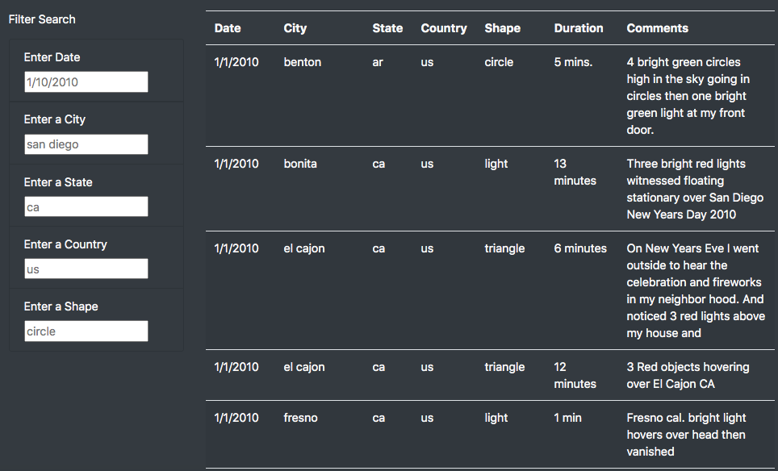
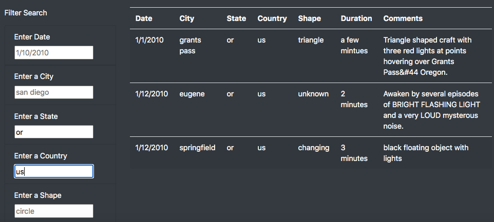

# UFOs

## Overview of the Project

The purpose of this project was to assist a journalism client named Dana in utilizing HTML, CSS, and JavaScript to create a customized, dynamic webpage for filtering information about UFO sighting reports in order to see if the dataset included any information about her hometown of McMinnville, Oregon.  To aid the client in filtering her JavaScript array of data, the webpage featured a dynamic table of the UFO sightings with corresponding input boxes, allowing users to input multiple criteria simultaneously to filter the associated table.  JavaScript functions were created to add data to the html "tbody" tags while the script was implemented into an HTML page and Bootstrap was employed to give it some aesthetic styling.  Additionally, a page header, article title, and article summary were included and the code was tested along the way using chrome devtools.  Ultimately, the webpage exhibited a nicely formatted, interactive user experience for filtering the data table according to date, location (city, state, and country) and/or the shape of the UFO object reported.

---------------------------------------------
## Resources:

Data Sources: 

    data.js

Software: 

    Chrome DevTools 86.0.4240.198, Visual Studio Code 1.49.2,
    Bootstrap 3.3.7, HTML5, ES6, D3

---------------------------------------------

## Results

As a result of the webpage creation, filtering a search proved as simple as inputting the desired criteria into one or more of the filter boxes and pressing "enter".  For example, upon visiting the webpage, the data table begins unfiltered.  You can also refresh the datatable by clicking "UFO Sightings" on the top left corner as shown below:

With the page refreshed, only "placeholder" values are given in the input boxes and the table will display all unfiltered dates, locations, and shape descriptions of the UFO sightings as shown here:

In order to filter the data table, the user may choose to input selection criteria for any number of input boxes by using the format shown by the placeholder values.  Once the preferred input boxes are filled to taste, the user only needs to press enter and the table will filter accordingly.  For instance, here is a filtered search for UFO sightings reported in the United States within the state of Oregon.

Here is a convenient link to the actual website to test it out if desired:

https://alexconerly.github.io/UFOs/

## Summary

From this analysis, it is clear that by incorporating html, csss, and JavaScript, one can very quickly and effectively create an exciting and interactive dynamic website that is highly flexible.  However, there may be some drawbacks to this particular design.  For one thing, this dynamic webpage does not allow filters for all columns of the table.  In particular, it does not filter the column headers of "duration" or "comments" in any way.  

With this limitation considered, one initial recommendation for further development could be to update the html list items to include these other columns as filter criteria.  Of course, filtering these columns could be more challenging than filtering the other columns because the currently filtered columns are already formatted consistently, making it easier for the user to filter a search according to the placeholder format.  Therefore, as a second recommendation, it may be advantageous to manipulate the columns to a more consistent format first in order to prepare them for user-friendly filtering.  That said, it may be more practical to manipulate the "duration" column than it would be for the "comments" column as the duration column has more consistency overall.  Hence, to adjust the duration column, formatting could potentially be accomplished using python and regex.  For example, one could change all the values for the "duration" column to be in the format of "# minutes" and that would make filtering an input as simple as typing in the number of minutes followed by the word "minutes".  Once the column is adjusted to a more consistent format, we could update the html list to include it, providing the user with a new search criteria.

In conclusion, the initial motivation for this project was to aid the client named "Dana" in filtering through the UFO sighting data to reveal information pertaining only to her hometown of McMinnville.  However, after making this webpage, it appears this dataset from the given JavaScript array did not include any McMinnville data for Dana.  In fact, this dataset only included three reported sightings in the whole state of Oregon (see results screenshots above).  Nevertheless, the dynamic webpage was still successful in filtering the dataset to aid the client.  Furthermore, Dana could easily reuse and/or refactor this code again on any number of JavaScript arrays to determine if other datasets might include the information she seeks about her hometown.